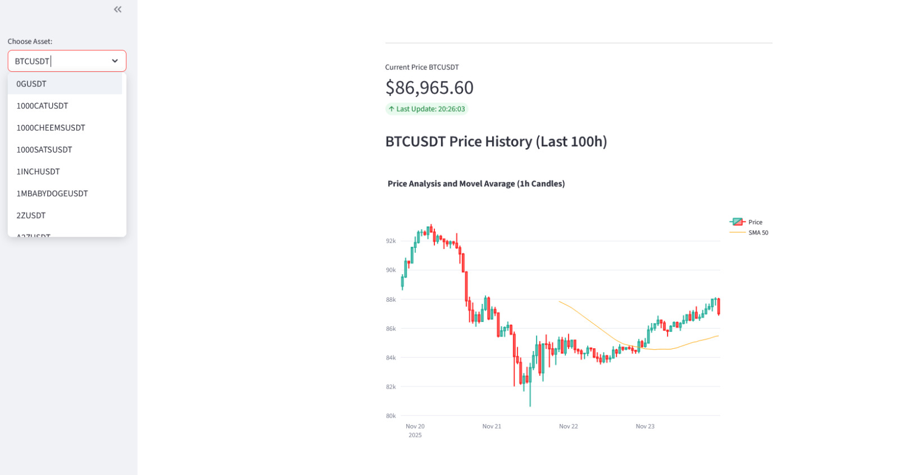
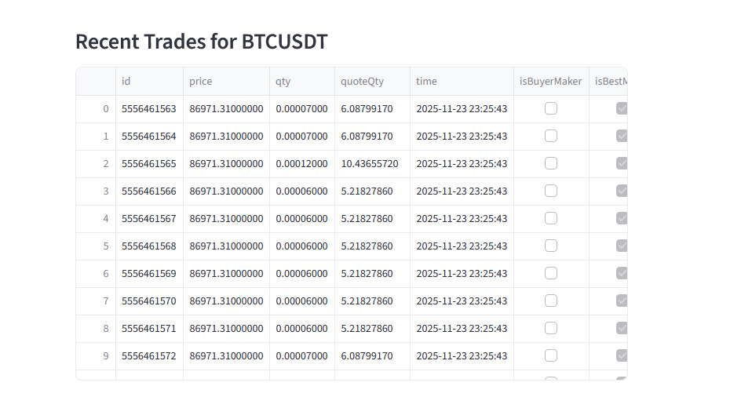

# 🪙 Crypto Tracker Dashboard

> The real-time Data Analysis dashboard, built with Python and Streamlit to monitor crypto assets. It provides clear historical visualization (candlesticks) and instant calculation of technical indicators.
---
**✨ Key Features**

    * Real-Time Prices: Price updates every 5 seconds for the selected asset.
    * Interactive Chart: 1-hour candles (last 100h) with the SMA 50 indicator, powered by Plotly.
    * Raw Data: Real-time table showing the Recent Trades data.
    * Wide Selection: Automatic list of all available USDT pairs on Binance.

**🛠️ Tech Stack**

    * Frontend & App: Streamlit
    * Data: Pandas, Binance API
    * Visualization: Plotly

    
